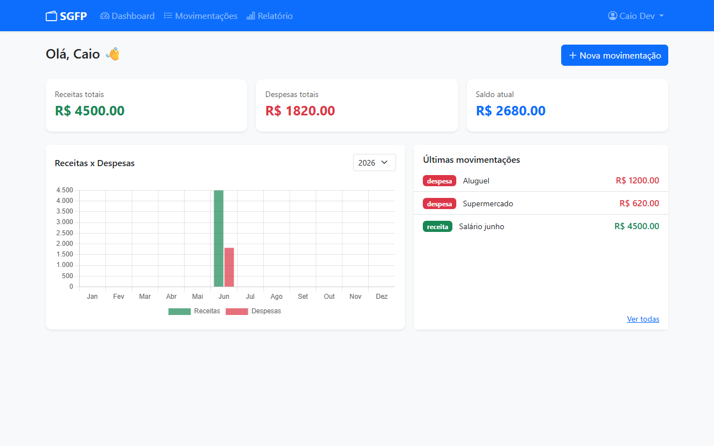
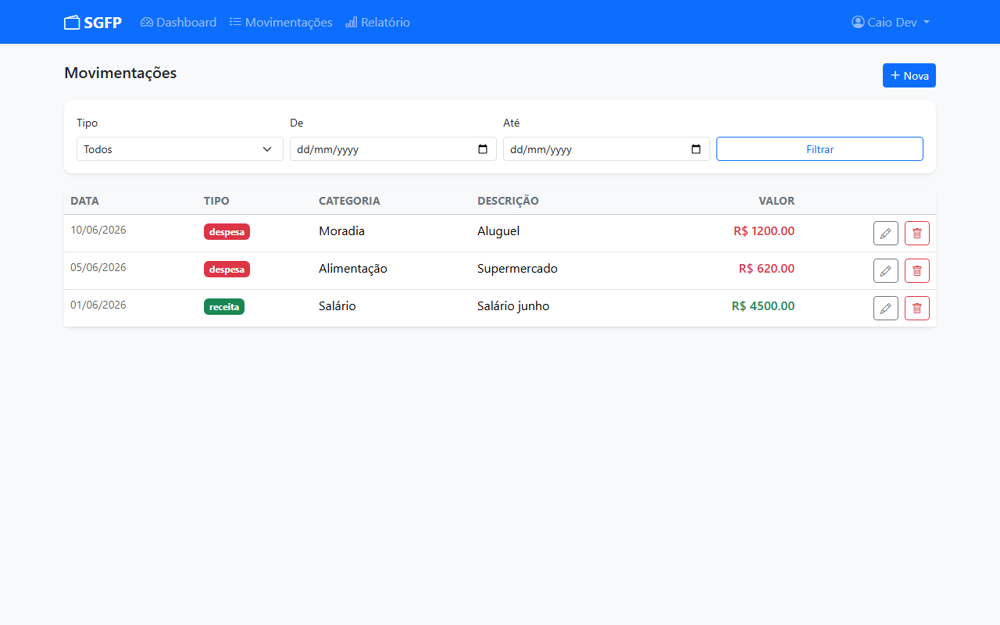
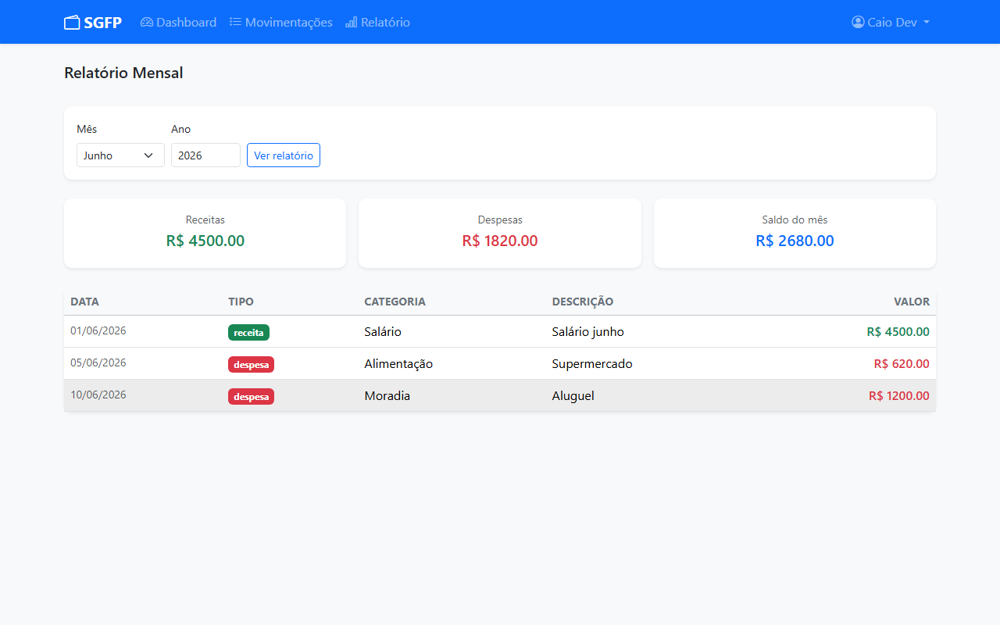

# SGFP - Sistema de Gerenciamento Financeiro Pessoal

Aplicação web para controle de finanças pessoais, desenvolvida com Python/Flask. Permite registrar receitas e despesas, visualizar um dashboard com resumo financeiro e consultar relatórios mensais.

## Capturas de tela

<p align="center">
  
</p>

<p align="center">
  
</p>

<p align="center">
  
</p>

## Funcionalidades

- Cadastro e autenticação de usuários
- Registro, edição e exclusão de receitas e despesas
- Dashboard com saldo atual, total de receitas e total de despesas
- Gráfico de receitas x despesas por mês (Chart.js)
- Listagem com filtro por tipo (receita/despesa) e período
- Relatório mensal detalhado

## Tecnologias

| Camada | Tecnologia |
|--------|-----------|
| Backend | Python 3, Flask, Flask-SQLAlchemy, Flask-Login |
| Banco de dados | SQLite |
| Frontend | Bootstrap 5, Chart.js, Bootstrap Icons |
| Utilitários | python-dotenv |

## Como executar localmente

**1. Clone o repositório**
```bash
git clone https://github.com/simplyyn/sgfp.git
cd sgfp
```

**2. Crie e ative o ambiente virtual**
```bash
python -m venv venv

# Windows
venv\Scripts\activate

# Linux/Mac
source venv/bin/activate
```

**3. Instale as dependências**
```bash
pip install -r requirements.txt
```

**4. Configure as variáveis de ambiente**
```bash
cp .env.example .env
# Edite o .env e defina um SECRET_KEY seguro
```

**5. Execute a aplicação**
```bash
python app.py
```

Acesse em: [http://localhost:5000](http://localhost:5000)

## Estrutura do projeto

```
sgfp/
├── app.py              # Configuração e inicialização do Flask
├── extensions.py       # Instâncias de db e login_manager
├── models.py           # Models do banco de dados (SQLAlchemy)
├── routes.py           # Rotas e lógica da aplicação
├── templates/          # Templates HTML (Jinja2)
│   ├── base.html
│   ├── login.html
│   ├── cadastro.html
│   ├── dashboard.html
│   ├── movimentacoes.html
│   ├── form_movimentacao.html
│   └── relatorio.html
├── static/css/
│   └── style.css
├── screenshots/
├── .env.example
└── requirements.txt
```

## Variáveis de ambiente

| Variável | Descrição | Exemplo |
|----------|-----------|---------|
| `SECRET_KEY` | Chave secreta do Flask | `uma-chave-longa-e-aleatoria` |
| `DATABASE_URL` | URI do banco de dados | `sqlite:///database.db` |

Copie `.env.example` para `.env` e preencha os valores antes de executar.

## Melhorias futuras

- Exportar relatório em PDF ou CSV
- Categorias personalizadas por usuário
- Metas de gastos por categoria
- Suporte a múltiplas moedas
